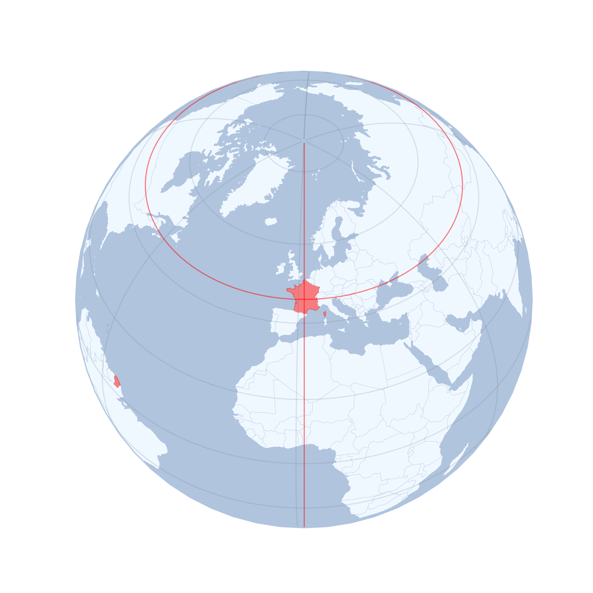

# auto-map

Utility script generating orthographic maps for every country.  
Generated images can be found in `/maps` folder.

Originaly developped to be included in an anki deck, to be released.

## Examples

## Dependencies
- `cartopy`
- `geopandas`
- `restcountries`
- `matplotlib`
